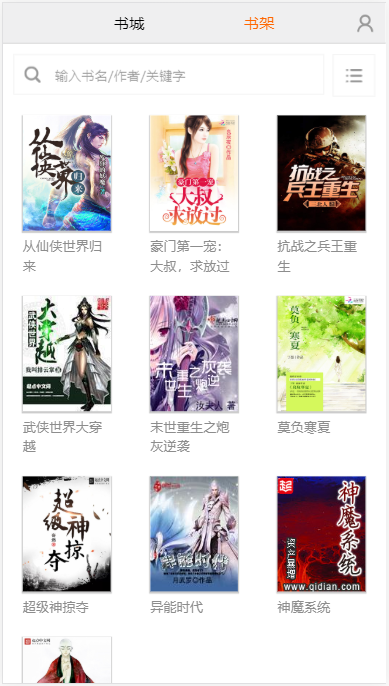
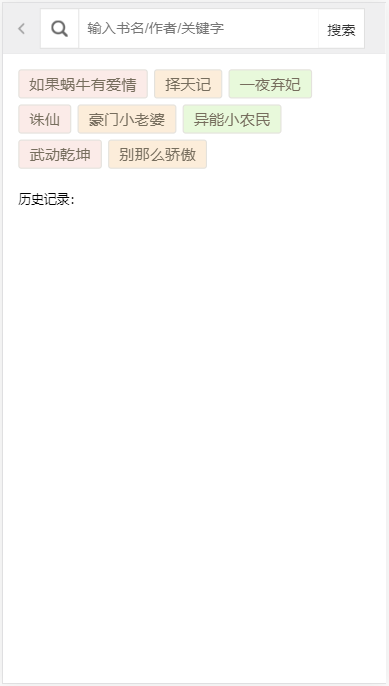
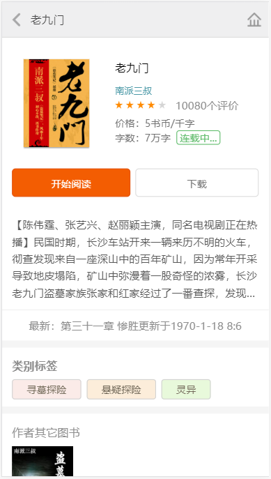
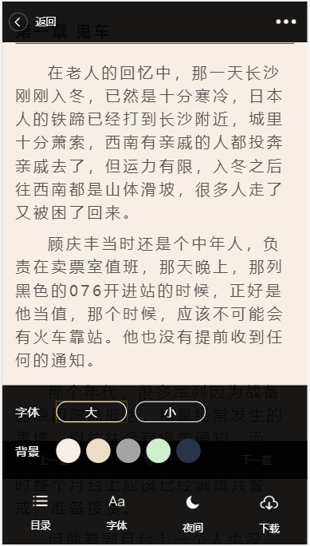
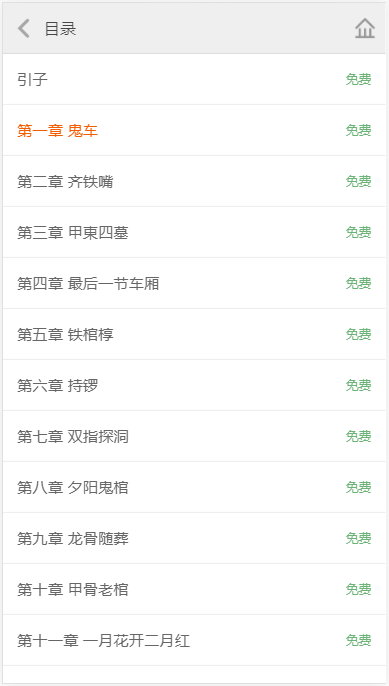

# bookCity
书城项目

>项目介绍

读书在小米 创作无极限 —— 这个口号一直是起点众多玄幻、魔幻、武侠、军文小说作者的创作目标，严谨的写作态度，锲而不舍的求新求变，与书友的直接沟通交流修改，从而起点中文网拥有国内很多具有一流水平的原创作品，使书友得以在第一时间阅读到作者连载的好书佳作。

>技术栈

gulp + require + handlebars + ES6/7 + ajax + sass + flex 

>项目运行
```
    git clone git@github.com:lizimu0312/bookCity.git
    npm instal
    npm run build
```

> 目录结构
```
book-city
    |——mock
    |    |——user
    |    |    |---user.json    //用户数据
    |    |——homePage
    |    |    |---home.json    //首页数据
    |    |    |---recommend1.json  //加载更多
    |    |    |---recommend2.json  //加载更多
    |    |    |---recommend3.json  //加载更多
    |    |——search
    |    |    |---search.json    //搜索结果
    |    |    |---searchKey.jso //搜索关键字
    |    |——detail
    |    |    |---352876.json    //老九门数据
    |    |——reader
    |    |    |---chapter-list.json    //目录
    |    |    |---data1.json//第一章的jsonp地址
    |    |    |---data2.json    //第二章的jsonp地址
    |    |    |---data3.json    //第三章的jsonp地址
    |    |    |---data4.json    //第四章的jsonp地址
    |    |-mock.js            //数据接口
    |——build
    |    |——page
    |    |    |——search.html //搜索页
    |    |    |——read.html //文章阅读页
    |    |    |——detail.html //详情页
    |    |    |——menu.html //目录页
    |    |    |——login.html //登录页
    |    |——js
    |    |    |——common
    |    |    |    |-handle.js   //handlebars模板编译公共方法
    |    |    |    |-getUrl.js  //获取地址栏参数
    |    |    |——index
    |    |    |    |-index.js   //首页
    |    |    |——search
    |    |    |    |-search.js   //搜索页
    |    |    |——read
    |    |    |    |-read.js   //文章阅读页
    |    |    |——detail
    |    |    |    |-detail.js   //详情页
    |    |    |——menu
    |    |    |    |-menu.js   //目录页
    |    |    |——login
    |    |    |    |-login.js   //登录页
    |    |    |——lib
    |    |    |    |-require.js
    |    |    |    |-handlebars.js
    |    |    |    |-flexible.js
    |    |    |    |-jquery.js
    |    |    |    |-jquery.base64.js //解码阅读文章 
    |    |    |    |-require.text.js
    |    |    |——main.js      //require配置文件
    |    |——css
    |    |    |-index.css
    |    |    |-common.css
    |    |    |-detail.css
    |    |    |-read.css
    |    |    |-menu.css
    |    |    |-search.css
    |    |——template
    |    |    |-index.html      //首页模板
    |    |    |-bestseller.html //本周最火和限时免费
    |    |    |-faves.html //女生最爱男生最爱加载更多
    |    |    |-recommend.html //重磅推荐模板
    |    |    |-detail.html //详情页模板
    |    |    |-handpick.html //精选模板
    |    |    |-search-shelf.html //搜索图书
    |    |-index.html           //首页
    |-gulpfile.js
```

> 部分截图








